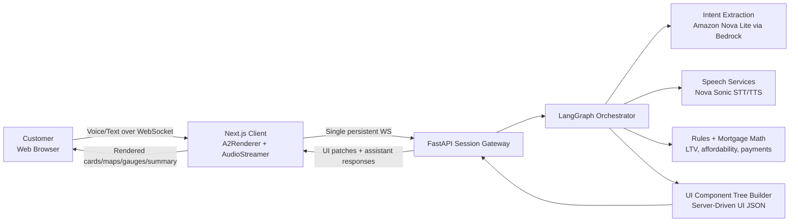
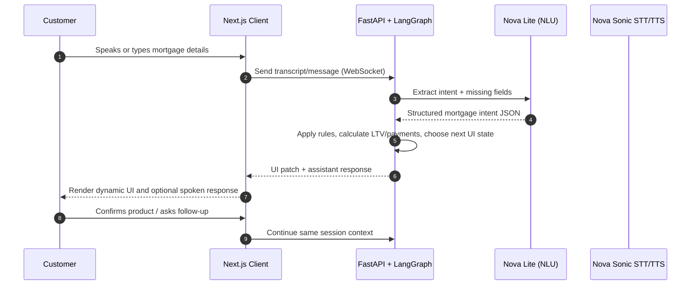
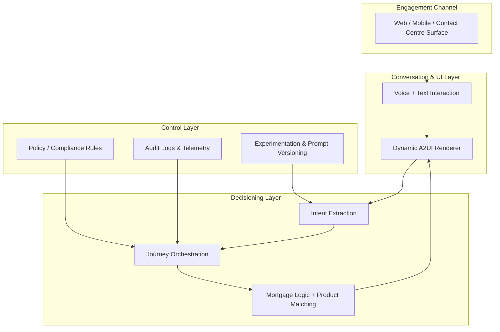

# C-Suite Presentation Pack: Barclays Mortgage Assistant Demo

This pack is designed to be copied directly into slides. It provides executive-ready diagrams, plain-language architecture explanations, and a narrative script you can use to demonstrate the proposition end-to-end.

---

## 1) Executive Idea (for Slide 1)

### One-line proposition
**Turn mortgage conversations into completed applications in one guided experience—voice or text—while the UI is generated dynamically by AI in real time.**

### Why this matters to the C-Suite
- **Revenue:** Faster conversion from enquiry to qualified mortgage journey.
- **Cost:** Fewer handoffs and reduced advisor time spent on repetitive data collection.
- **Customer Experience:** Natural conversation instead of long forms.
- **Control:** Central policy and product logic stays server-side, with auditable decision paths.

### Business framing
This is not “just a chatbot.” It is a **conversation-to-application engine** where:
1. The customer speaks naturally.
2. AI extracts structured mortgage intent.
3. The backend generates the exact UI components required at that moment.
4. The customer receives personalized product comparison and next-step guidance.

---

## 2) Architecture Diagram (for Slide 2)

### Executive explanation
- The **browser stays lightweight**: it renders whatever component tree the server sends.
- The **server is the control plane**: orchestration, rules, policy logic, product matching.
- A **single WebSocket session** supports low-latency back-and-forth across text, voice, and UI updates.
- This design improves governance because business logic is centralized and versionable.

---

## 3) “How It Works” Sequence (for Slide 3)

### Executive explanation
- Every turn follows a deterministic loop: **input → extraction → validation → UI output**.
- The customer sees only the **next best step**, reducing abandonment.
- The same pattern supports both assisted and self-serve journeys.

---

## 4) Operating Model Diagram (for Slide 4)

### Executive explanation
- This is a **scalable operating model**, not a one-off demo architecture.
- Governance and observability are explicit layers, enabling controlled rollout by segment, channel, and risk profile.

---

## 5) Demonstration Narrative (talk track)

Use this script in a 7–10 minute C-suite demo.

### Act 1 — Strategic setup (1 minute)
“Today we’ll show how Barclays can move from static mortgage journeys to a conversation-led, AI-generated experience. The key point: the customer does not complete a long form first. They begin with natural language, and the system builds the right interface in real time.”

### Act 2 — Live journey (3–4 minutes)
1. Start at the home screen and choose **First-Time Buyer**.
2. Speak naturally: “I found a property around £400,000 and need to borrow £350,000.”
3. Show the system asking only the next missing question.
4. Reveal the generated UI: map, property info, LTV gauge, product cards.
5. Move the term slider and show live monthly repayment recalculation.
6. Select a product and show the Agreement in Principle summary.

**Narration cue:**
“What you’re seeing is server-driven UI. The backend is deciding both what to ask next and what to render next, based on structured intent and policy-safe calculations.”

### Act 3 — Executive value (2 minutes)
“From a business perspective, this compresses the journey from discovery to qualified intent. It reduces friction for customers, increases throughput for advisors, and keeps policy logic centrally controlled for risk and compliance.”

### Act 4 — Scale and control (1–2 minutes)
“Because this architecture is modular, we can extend to remortgage, buy-to-let, and moving home with the same runtime. We can also plug into contact centre channels while preserving shared decisioning, telemetry, and governance.”

### Closing statement (30 seconds)
“This is a practical path to AI-enabled origination: better customer outcomes, stronger operational leverage, and enterprise-grade control.”

---

## 6) Suggested Slide Structure (ready-to-build)

1. **The Opportunity:** Friction in current mortgage journeys
2. **The Proposition:** Conversation-to-application engine
3. **Architecture Overview:** Real-time AI + server-driven UI
4. **Interaction Sequence:** How one turn becomes progress
5. **Live Demo Screens:** Category, Q&A, comparison, summary
6. **Value Case:** Conversion, cost-to-serve, CX, governance
7. **Target Operating Model:** Channel + intelligence + control layers
8. **Rollout Plan:** Pilot segment, KPIs, risk controls, scale roadmap

---

## 7) KPI Framework (for Q&A / appendix)

### Commercial KPIs
- Enquiry-to-qualified-lead conversion rate
- Quote-to-application progression rate
- Time-to-decision milestone completion

### Operational KPIs
- Average handling time reduction (assisted channel)
- Self-serve completion rate
- Handoff rate to human colleague

### Experience KPIs
- Customer effort score
- Drop-off by journey stage
- Latency (TTFB, UI patch, voice response)

### Governance KPIs
- Rule-violation incidence
- Audit completeness per session
- Prompt/model version drift tracking

---

## 8) Objection Handling (executive Q&A prompts)

- **“Is this safe for regulated decisions?”**  
  Position as guided pre-application and recommendation support, with policy logic and disclosures controlled server-side.

- **“Can we control what the AI says?”**  
  Yes—use constrained prompts, deterministic business-rule layers, and auditable response logging.

- **“Will this integrate with existing channels?”**  
  Yes—the architecture is channel-agnostic; web, mobile, and contact centre can share the same orchestration core.

- **“How quickly can we pilot?”**  
  Start with one segment (e.g., FTB), defined KPIs, and staged compliance sign-off before expansion.

---

## 9) Presenter Notes (quick reminders)

- Lead with **business outcomes**, not model names.
- Describe AI as an **accelerator inside a governed system**, not autonomous decisioning.
- Emphasize **modularity and reuse** across mortgage categories and channels.
- Keep demo pacing tight: no more than 60–90 seconds per screen.
