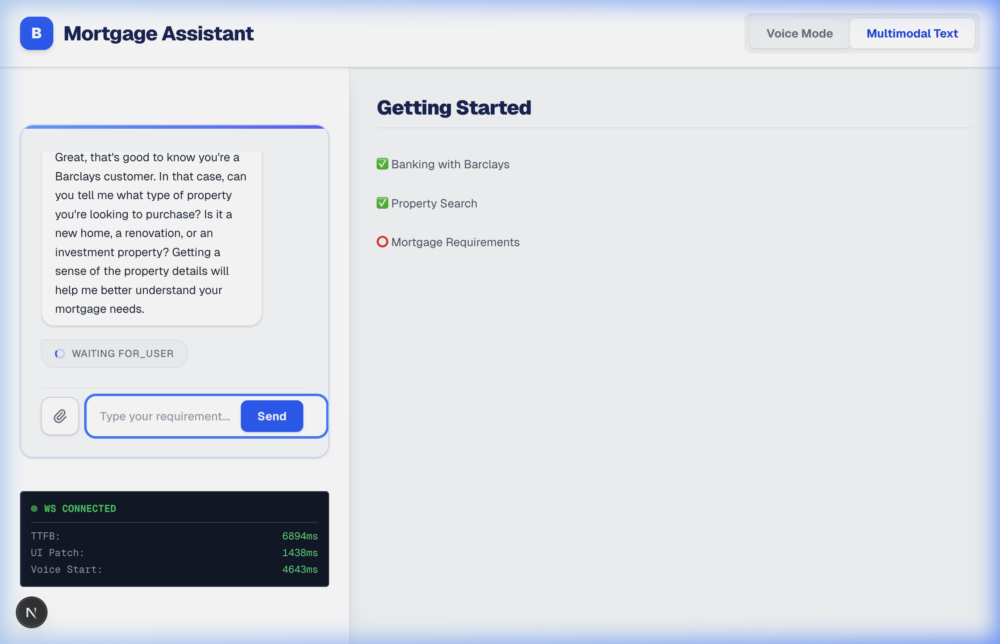
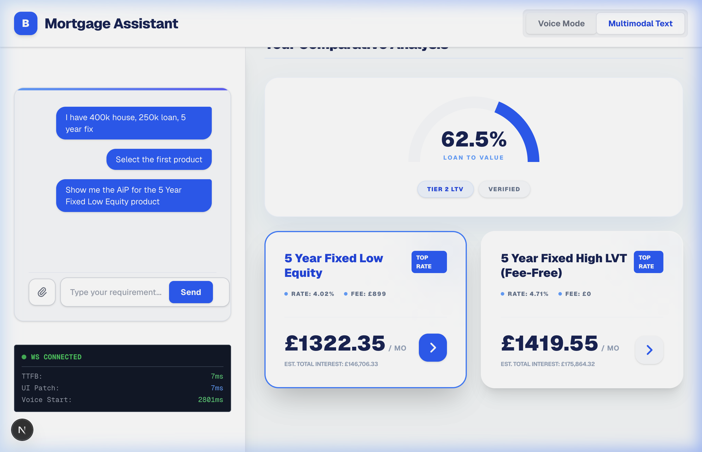
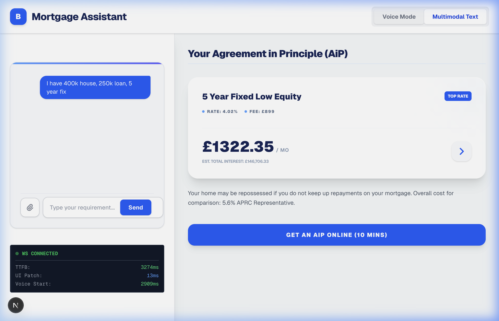

# Walkthrough - Barclays Mortgage Assistant Refinement

The Barclays Mortgage Assistant is now fully grounded in official Barclays data and compliant with the Google A2UI v0.9 specification. The application provides a realistic and legally compliant experience for users exploring mortgage options.

## Key Enhancements

### 1. Real-World Data Grounding
The assistant now uses current mortgage products, rates, and fees sourced from the official Barclays website (as of Feb 2026).
- **Products**: Includes "2 Year Fixed Purchase", "5 Year Fixed Low Equity", etc.
- **Accurate Fees**: Reflected in the `ProductCard` details (e.g., £899 for Low Equity).
- **Automatic LTV Calculation**: The system accurately calculates LTV and filters products that match the user's equity position.

### 2. A2UI v0.9 Compliance
The server-driven UI (SDUI) has been refactored to use a recursive renderer compatible with the official A2UI specification.
- **Surface-based Updates**: The UI updates the `main` surface with complex layouts containing Columns, Rows, and custom components.
- **New Components**: Added support for `Gauge`, `ProductCard`, and `Button` (with external link handling).

### 3. Agreement in Principle (AiP) Flow
A definitive transition from product comparison to a summary view has been implemented.
- **Legal Compliance**: Includes mandatory Barclays disclaimers and representative APRC figures.
- **Direct Application**: A "Get an AiP online" button provides a direct link to the Barclays official application page.

### 4. Conversational Warm-up (Day 0 Experience)
The assistant now prioritizes a human-like onboarding flow.
- **Baseline Questions**: Starts by validating banking status and property search state.
- **Dynamic A2UI Checklist**: The right-hand panel reflects this conversational progress in real-time.

## Visual Evidence

````carousel

<!-- slide -->

<!-- slide -->

<!-- slide -->

````

### End-to-End Interaction Recording
The following recording demonstrates the complete flow from user input to the final AiP summary screen:


## Technical Verification
- **Unit Tests**: Verified backend A2UI payload generation in `verify_a2ui_generation.py`.
- **E2E Browser Automation**: Confirmed state transitions and component rendering using professional browser subagent tools.
